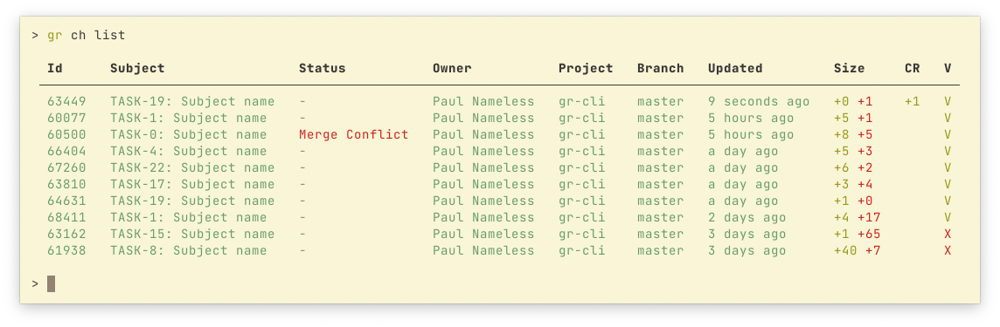

# gr

Gerrit's command line tool

This tools is very basic but it does all what I need at the moment (though I am happy to accept PRs)



## Installation

```sh
pip3 install gr-cli
```

## Auth

At the moment the only way it works is by `HTTP credentials` auth: [https://gerrit.cloudlinux.com/settings/#HTTPCredentials](https://gerrit.cloudlinux.com/settings/#HTTPCredentials)

At first launch, `gr` will ask for user and password that you generated at bitbucket and write to `~/.config/gr/conf.py`. That's plain python file and you can use it to store information securely:

```python
import os

pswd = os.popen("pass show cl/gr-cli | head -n 1").read().strip()
user = os.popen("pass show cl/gr-cli | grep username").read().strip().split(" ")[-1]

AUTH = (user, pswd)
```

## Usage

```sh
> gr ch --help
Usage: main.py ch [OPTIONS] COMMAND [ARGS]...

  Manage pull requests

Options:
  --help  Show this message and exit.

Commands:
  abandon        Abandon change by ID
  add-reviewers  Abandon change by ID
  checkout       Checkout change to new branch
  comment        Comment change by ID
  comments       List change comments by ID
  create         Create change from current branch
  diff           Show diff by change ID
  list           List all changes
  merge          Submit change by ID
  rebase         Rebase change to target branch by ID
  review         Review change by ID
  status         List all CHanges
  view           View change details
```

## Example

```sh
git checkout -b test-gr
echo Changes > file.txt
git add file.txt
git commit -m 'New very important patch'

# push current branch to remote and create PR
gr ch create

gr ch list

gr ch merge [change-id]
```
